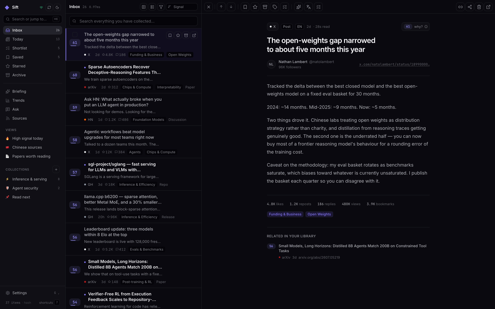
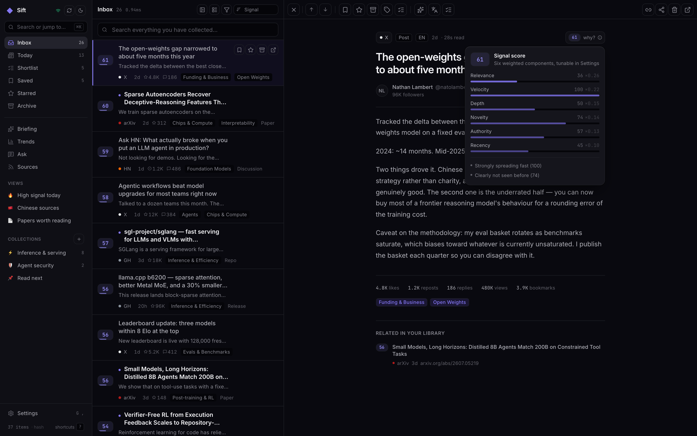
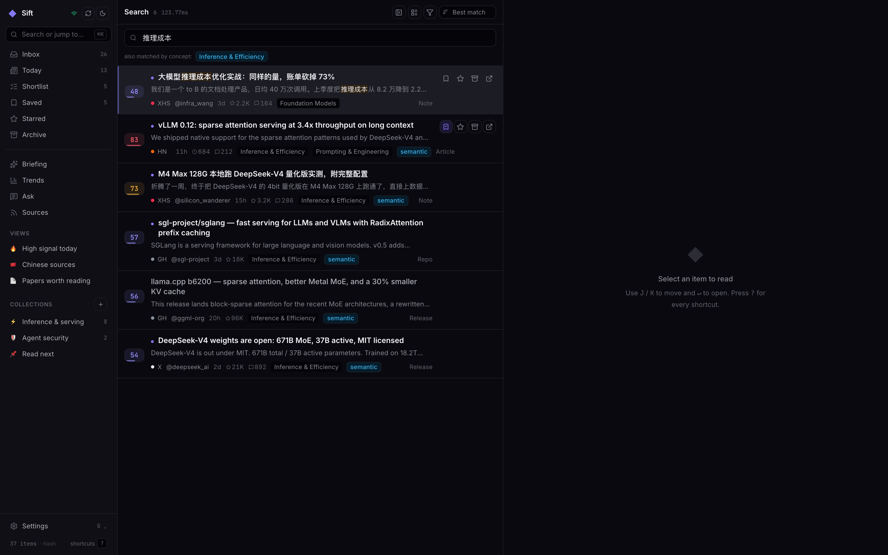
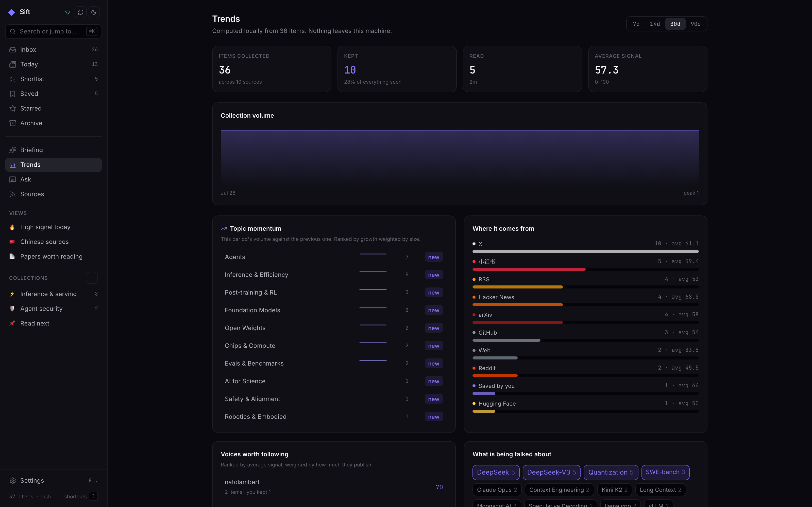
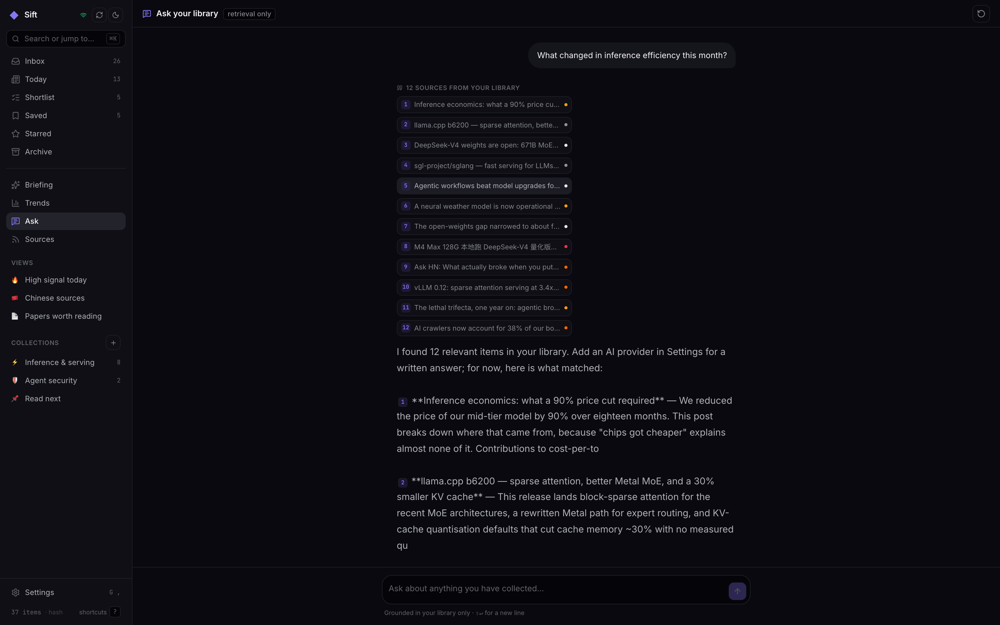
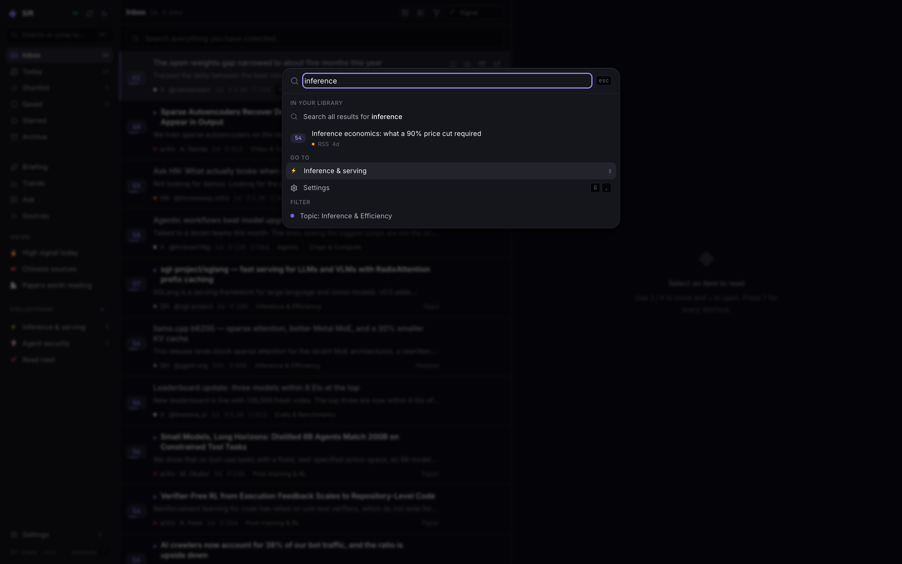
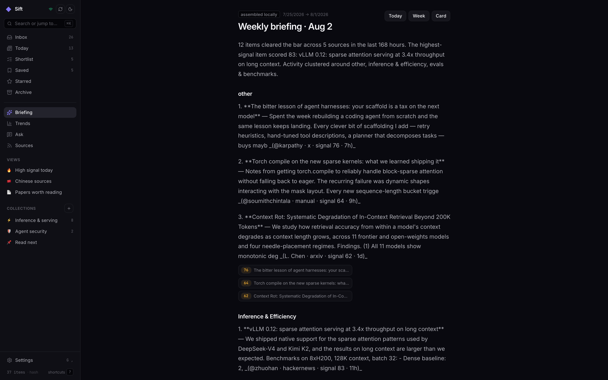
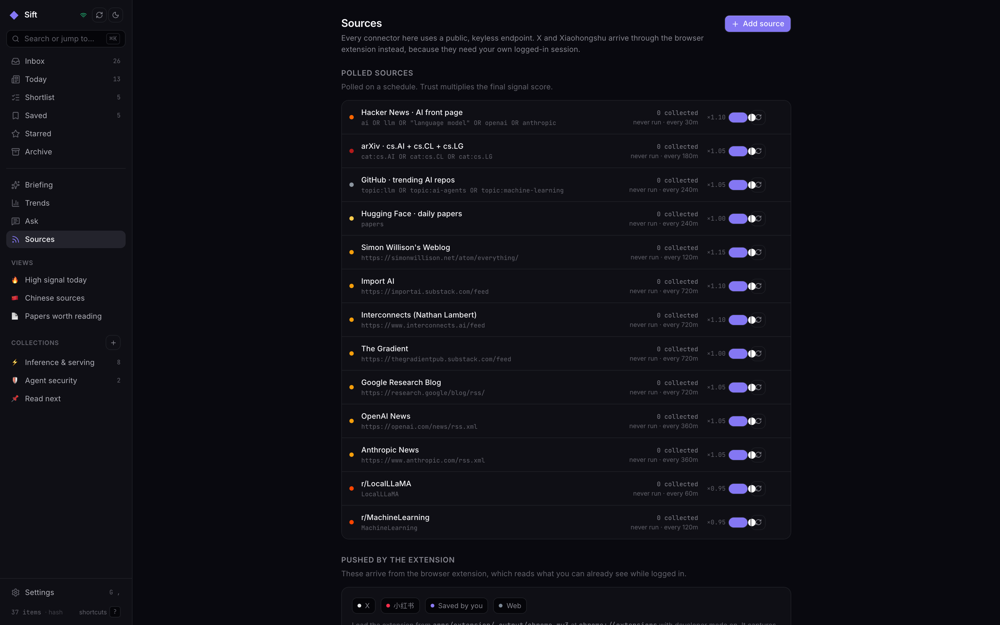
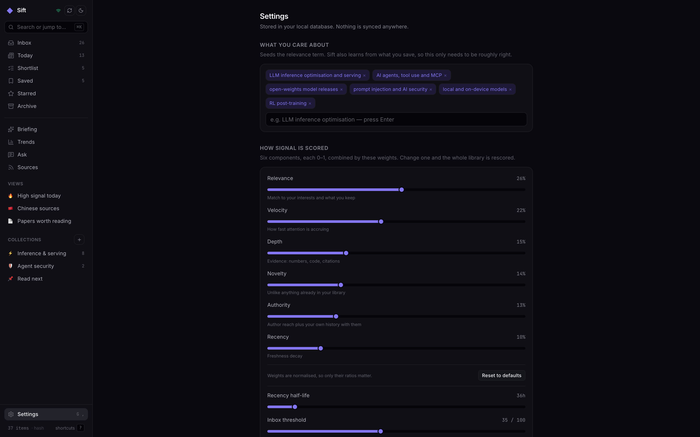
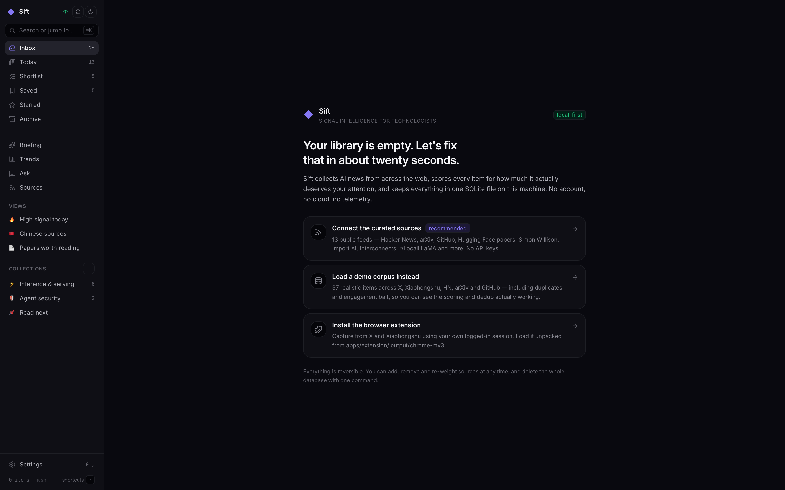

<div align="center">


# Sift

**Signal Intelligence For Technologists**

A local-first AI intelligence workstation. Harvest what matters from X, 小红书, Hacker News, arXiv, GitHub and your feeds — then score it, search it in either language, and turn it into briefings. Everything runs on your machine, in one SQLite file.

[](LICENSE)
[](https://nodejs.org)
[](#why-zero-native-dependencies)
[](#testing)

[Quick start](#quick-start) · [How it works](#how-it-works) · [Signal scoring](#signal-scoring) · [Extension](#the-browser-extension) · [Architecture](docs/ARCHITECTURE.md) · [Website](https://micaho26.github.io/sift)

</div>

<br />



<br />

## Why

Following AI properly has become a part-time job. Six timelines, forty feeds, three languages. The same launch reported twenty times over. Engagement bait ranked above the benchmark table that actually answers your question. Bookmarks you will never open again, because nothing can search them.

Every tool solves one slice — a reader that cannot rank, an aggregator that cannot search your highlights, a scraper with no opinion about what is worth reading. Sift is the whole loop, and it runs locally, so your reading history is nobody's dataset.

| | |
|---|---|
| **Collects** | 8 built-in keyless connectors + a browser extension for X and 小红书 |
| **Ranks** | 6 explainable components, per-source trust, engagement-bait penalty |
| **Dedupes** | SimHash LSH for reposts, embedding similarity for the same story retold |
| **Searches** | BM25 + concept expansion + vector KNN, fused by reciprocal rank — in English *and* Chinese |
| **Synthesises** | Cited briefings, retrieval-grounded chat over your own corpus |
| **Costs** | Nothing. No account, no API key required, no telemetry |

<br />

## Quick start

Requires **Node 24+** and **pnpm**. Nothing else — no database to provision, no key to obtain.

```bash
git clone https://github.com/micaho26/sift && cd sift
pnpm install     # zero native modules, so this cannot fail on a compile step
pnpm seed        # optional: 37 realistic items to judge it before configuring
pnpm dev         # starts the API + app and opens your browser
```

That is it. `pnpm dev` prints something like:

```
  ◆ Sift · starting
  api :4471   web :4470
──────────────────────────────────────────────────────────
  ▸ Sift is running   http://127.0.0.1:4470
  37 items · hash/384d · AI: not configured
──────────────────────────────────────────────────────────
```

<details>
<summary><strong>Other commands</strong></summary>

```bash
pnpm start              # production mode: build once, serve app + API on one port
pnpm build:extension    # build the Chrome/Edge/Brave extension
pnpm test               # run every test suite
pnpm typecheck          # typecheck every package
pnpm seed               # (re)load the demo corpus — idempotent
pnpm db:reset           # delete the local database (asks for confirmation)
pnpm screenshots        # regenerate the screenshots in assets/
```

Environment variables, all optional:

| Variable | Default | Purpose |
|---|---|---|
| `SIFT_PORT` | `4471` | API port |
| `SIFT_WEB_PORT` | `4470` | Vite dev-server port |
| `SIFT_DB` | `./data/sift.db` | Database location |
| `SIFT_DATA_DIR` | `./data` | Data directory |
| `SIFT_LOG` | `info` | `debug` \| `info` \| `quiet` |
| `SIFT_NO_SCHEDULER` | — | `1` disables background polling |
| `SIFT_NO_OPEN` | — | `1` stops `pnpm dev` opening a browser |

</details>

<br />

## How it works

```
                    ┌─────────────────────────────────────────────┐
   browser          │  extension (MV3)                            │
   ┌──────────┐     │  ┌────────────────┐   ┌──────────────────┐  │
   │ x.com    │────▶│  │ MAIN world     │──▶│ isolated content │  │
   │ 小红书    │     │  │ observes the   │   │ script extracts  │  │
   │ any page │     │  │ page's own     │   │ items            │  │
   └──────────┘     │  │ fetch / XHR    │   └────────┬─────────┘  │
                    │  └────────────────┘            │            │
                    └────────────────────────────────┼────────────┘
                                                     │ coalesced batches
   ┌─────────────────────────────────┐               ▼
   │ connectors (server-side)        │      ┌──────────────────────┐
   │ HN · arXiv · GitHub · HF        │─────▶│  ingestion pipeline  │
   │ Reddit · RSS/Atom               │      │                      │
   └─────────────────────────────────┘      │ canonicalise URL     │
                                            │ mute filters         │
                                            │ topics + entities    │
                                            │ SimHash fingerprint  │
                                            │ ── dedup (2 tiers)   │
                                            │ embed (384-d)        │
                                            │ score (6 components) │
                                            └──────────┬───────────┘
                                                       ▼
   ┌──────────────────────────────────────────────────────────────────┐
   │  SQLite  ·  ./data/sift.db                                       │
   │  items · items_fts (BM25 + CJK bigrams) · item_bands (LSH)       │
   │  item_topics · item_entities · collections · highlights          │
   │  + an in-process flat Float32Array vector index (exact KNN)      │
   └──────────────────────────────────────────────────────────────────┘
                                                       ▼
   ┌──────────────────────────────────────────────────────────────────┐
   │  Hono API (loopback only)  ·  SSE for live updates               │
   └──────────────────────────────────────────────────────────────────┘
                                                       ▼
   ┌──────────────────────────────────────────────────────────────────┐
   │  React 19 app — feed · reader · search · trends · ask · briefing  │
   └──────────────────────────────────────────────────────────────────┘
```

Full detail in **[docs/ARCHITECTURE.md](docs/ARCHITECTURE.md)**.

<br />

## Signal scoring

Every item gets a 0–100 score answering one question: *should this interrupt you?* Six components, each squashed so no single axis can be gamed into dominance.

| Component | Weight | What it measures |
|---|---:|---|
| **Relevance** | 26% | Cosine to your interest clusters + explicit keyword hits |
| **Velocity** | 22% | Attention per hour, normalised against the source's own p95 |
| **Depth** | 15% | Evidence: numbers, code, citations, artefacts, hedged claims |
| **Novelty** | 14% | 1 − similarity to everything already in your library |
| **Authority** | 13% | Author reach × how often *you* keep their work |
| **Recency** | 10% | Exponential decay, half-life you choose (default 36h) |

Then multiplied by a per-source trust factor, and reduced by up to 30% for engagement-bait patterns — emoji density, hashtag stuffing, giveaway language, in both English and Chinese.

**The score always shows its work.** Press <kbd>W</kbd> on any item:



Measured on the bundled demo corpus: a thread with benchmark numbers, an ablation and a repo link scores **66**. A post with 32,000 likes, nine hashtags and "this will blow your mind" scores **31** — the depth term and the noise penalty both bite.

Every weight is a slider in Settings. Move one and the whole library rescores in the background. Formulas in **[docs/SCORING.md](docs/SCORING.md)**.

<br />

## Search that works in two languages

Four retrievers, fused by [Reciprocal Rank Fusion](https://plg.uwaterloo.ca/~gvcormac/cormacksigir09-rrf.pdf) rather than score normalisation, because BM25 and cosine live on incomparable scales:

1. **Keyword** — FTS5 BM25 over title / body / author / tags, with column weights.
2. **Concept** — the query is run through the same 24-topic AI taxonomy the items were, so *"making models cheaper to run"* retrieves the `efficiency` topic with no neural model involved.
3. **Semantic** — exact cosine KNN over an in-memory flat matrix.
4. **Browse** — no query, one indexed scan. The common case pays for none of the above.

### Chinese is a first-class citizen

SQLite's `unicode61` tokeniser treats an entire Chinese sentence as one token, so Chinese search silently returns nothing. Sift indexes a parallel column of character bigrams and translates queries into ordered bigram *phrases*, which is exact substring matching:

| You type | Becomes | Finds |
|---|---|---|
| `量化` | `cjk : "量化"` | 「M4 Max 本地跑 DeepSeek-V4 **量化**版实测」 |
| `vLLM 推理` | `cjk : "推理" AND "vllm"*` | mixed script splits cleanly |
| `怎么降低推理成本` | affixes stripped → OR-ed 4-char windows | 「大模型**推理成本**优化实战」 |



<br />

## Deduplication, in two tiers

Exact-URL matching catches the same link twice. It does not catch the twenty accounts that all posted *"OpenAI just shipped X"* in different words — which is the actual failure mode of an AI feed.

**Tier 1 — SimHash + LSH.** A 64-bit fingerprint over weighted word bigrams, split into four 16-bit bands. By the pigeonhole principle any two prints within Hamming distance 3 must collide on at least one band, so an equality index gives complete recall from one query instead of a full scan.

**Tier 2 — embedding similarity.** Measured on our own corpus, a genuine repost sits at Hamming 22 while unrelated items sit at 27–31 — far too narrow to threshold safely. Cosine separates the same pair 0.60 vs 0.29. So tier 2 uses the vector, gated on **a shared named entity** and **a 72-hour window**, which stops topical resemblance alone from folding two distinct stories together.

Nothing is ever deleted. Echoes fold behind their canonical item with a count, and stay fully searchable.

<br />

## Features

<table>
<tr><td width="50%" valign="top">

**Keyboard-first triage**
`J`/`K` to move, `S` save, `E` archive, `L` shortlist, `F` star, `X` multi-select, `⌘K` for everything. Optimistic updates with 6 seconds of undo. Press `?` for the full map.

</td><td width="50%" valign="top">

**Ask your own library**
Retrieval-grounded chat scoped strictly to what you have collected. Citations arrive *before* the first token and link back. If the answer is not in your corpus, it says so.

</td></tr>
<tr><td valign="top">

**Trends that say something**
Not "which topics are big" — always the same few — but which are *accelerating*, against the previous window, with smoothing so a fresh install does not claim 17× growth on three items.

</td><td valign="top">

**Cited briefings**
Themed daily or weekly digests where every claim carries the bracketed number of the item it came from. Works without an LLM: the template path clusters and assembles locally.

</td></tr>
<tr><td valign="top">

**Collections, highlights, tags**
Boards with manual ordering, highlight-with-note, and tags that survive a re-crawl. Re-ingesting an item never clobbers anything you did by hand.

</td><td valign="top">

**Real export**
Markdown with your highlights, JSON with every field, CSV (BOM'd so Excel opens Chinese correctly), OPML for your feeds, and a share card rendered locally as SVG → PNG.

</td></tr>
</table>

<details>
<summary><strong>More screenshots</strong></summary>

### Trends


### Ask your library


### Command palette


### Briefing


### Sources


### Settings — the scoring weights are yours


### Share card


### Light theme


### First run


</details>

<br />

## The browser extension

Some sources need your own logged-in session. The extension covers those.

```bash
pnpm build:extension
# chrome://extensions → developer mode → Load unpacked
# → apps/extension/.output/chrome-mv3
```


**How it gets the data.** A `MAIN`-world script observes the page's *own* `fetch` and `XMLHttpRequest` responses and forwards the JSON to the extension. Nothing is re-requested, no credentials are touched, and no scraping traffic is generated — the extension reads what your browser already received, at the rate you browse. The DOM is scraped only as a fallback when a response shape changes.

The JSON walkers are **shape-tolerant by construction**: rather than hardcode `data.home.home_timeline_urt.instructions[].entries[]…`, they recursively look for anything that *resembles* a tweet (`legacy.full_text` + an id) or a note (a 24-hex id + a title). A platform reshuffling its envelope does not break capture.

**Permissions are narrow.** Three hosts plus loopback. No `<all_urls>`, no `tabs`, no cookie access. Page capture rides on `activeTab`, so it can only ever run where you invoked it. Content scripts never talk to the Sift server — everything routes through the worker, which verifies a `service: "sift"` handshake before posting anything.

Per-site auto-collection toggles with <kbd>⌥⇧H</kbd>; <kbd>⌥⇧S</kbd> captures the current page (or just your text selection).

Detail in **[docs/EXTENSION.md](docs/EXTENSION.md)**.

<br clear="right" />

## AI features are optional

Sift is complete without an API key.

| Feature | Without a provider | With one |
|---|---|---|
| Semantic search | Built-in hashing embedder — instant, offline | Real paraphrase matching |
| Summaries | Local extractive summarisation | Written prose |
| Takeaways | Top-scoring sentences | Extracted claims |
| Ask | Returns the matching items | A cited written answer |
| Briefings | Clustered and assembled locally | Themed prose with citations |
| Translation | *unavailable* | zh ↔ en |

Providers: **Anthropic**, **OpenAI**-compatible, **Ollama**. Keys are stored in the local database and **never returned by any endpoint** — the API only reports whether one is set.

The default embedder hashes character n-grams into 384 dimensions. It captures lexical and sub-word similarity rather than true paraphrase, which is an honest trade for needing no download and working offline on the very first run. Switch to a transformer, Ollama or OpenAI in Settings and the library re-embeds in the background.

<br />

## Privacy

- **One file.** Everything is in `./data/sift.db`. Back it up by copying it.
- **Loopback only.** The server binds `127.0.0.1`. CORS admits extension origins and localhost; nothing else.
- **No telemetry.** Not opt-out — absent. There is no analytics code in this repository.
- **Keys are write-only.** Paste-in, never read back.
- **`data/` is gitignored.** Your corpus cannot be committed by accident.

<br />

## Why zero native dependencies

`pnpm install` failing on `node-gyp` is the most common reason a local tool never gets run. So Sift has no native modules at all: SQLite comes from Node 24's built-in `node:sqlite`, which ships FTS5, WAL and window functions. The vector index is a hand-written flat scan — one contiguous `Float32Array`, exact cosine KNN, unrolled by four.

At the scale of a personal corpus this is not a compromise. 100k items × 384 dims is ~38M multiply-adds, around 25 ms — and there is no index to rebuild, no recall cliff, and no stale-index class of bug. An ANN library would be faster and strictly worse here.

Runtime dependencies, in total:

| Package | Runtime deps |
|---|---|
| `@sift/core` | `zod` |
| `sift-server` | `hono`, `@hono/node-server`, `@hono/zod-validator`, `zod` |
| `sift-web` | `react`, `react-dom`, TanStack Query/Virtual, `cmdk`, `sonner`, `lucide-react`, `motion` |
| `sift-extension` | `react`, `react-dom` |

<br />

## Project layout

```
sift/
├── apps/
│   ├── server/          Hono API · connectors · pipeline · AI · SQLite
│   │   └── src/
│   │       ├── db/          schema, access layer, flat vector index
│   │       ├── connectors/  HN, arXiv, GitHub, HF, Reddit, RSS + scheduler
│   │       ├── pipeline/     ingest, rescore, interest profile
│   │       ├── repo/         items, library, sources, settings
│   │       ├── ai/           provider, prompts, digest
│   │       ├── routes/       the HTTP surface
│   │       └── share/        SVG share cards
│   ├── web/             React 19 + Vite 8 + Tailwind 4
│   ├── extension/       WXT · MV3 · X + 小红书 + article extractors
│   └── site/            Astro marketing site
├── packages/core/       types · scoring · SimHash · RRF · taxonomy · embedder
├── scripts/             dev, start, screenshots, postinstall
└── docs/                architecture, scoring, extension, API
```

<br />

## Testing

```bash
pnpm test
```

52 tests, no mocks of our own logic:

- **`packages/core`** (39) — URL canonicalisation across platform aliases, SimHash discrimination, CJK query construction, the full scoring model including degenerate and adversarial inputs, RRF and MMR, the hashing embedder's determinism and ordering, taxonomy precision.
- **`apps/extension`** (13) — the JSON walkers against realistic X and Xiaohongshu envelopes, including cyclic and over-deep input, Chinese count parsing (`1.2万` → 12000), and endpoint-matcher precision.

The scoring tests assert *behaviour*, not values — e.g. "a substantive thread outranks viral bait", "the fortieth copy of a story ranks below the first", "clock skew cannot push a score out of range".

<br />

## Contributing

Issues and PRs welcome. See [CONTRIBUTING.md](CONTRIBUTING.md). The codebase is written to be read: every non-obvious decision has a comment explaining *why*, and there is no build step between the source and what runs in development.

Good first areas: more connectors (`apps/server/src/connectors/`), more entries in the AI lexicon (`packages/core/src/taxonomy.ts`), a Firefox build of the extension, better article extraction.

<br />

## Acknowledgements

The ideas here are not new — the implementation is. Reciprocal Rank Fusion is Cormack, Clarke & Buettcher (SIGIR 2009). SimHash is Charikar (2002), with the band scheme from Manku, Jain & Das Sarma (WWW 2007). MMR is Carbonell & Goldstein (SIGIR 1998). The gravity term in the velocity component is Hacker News's.

<br />

## License

[MIT](LICENSE).

<div align="center">
<br />
<sub>Built to be read, forked and disagreed with.</sub>
</div>
